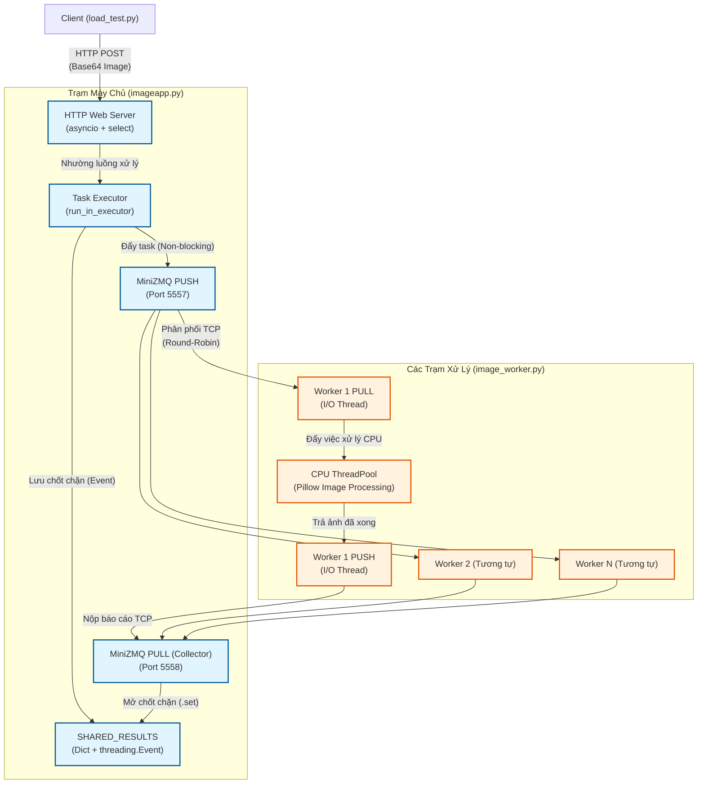
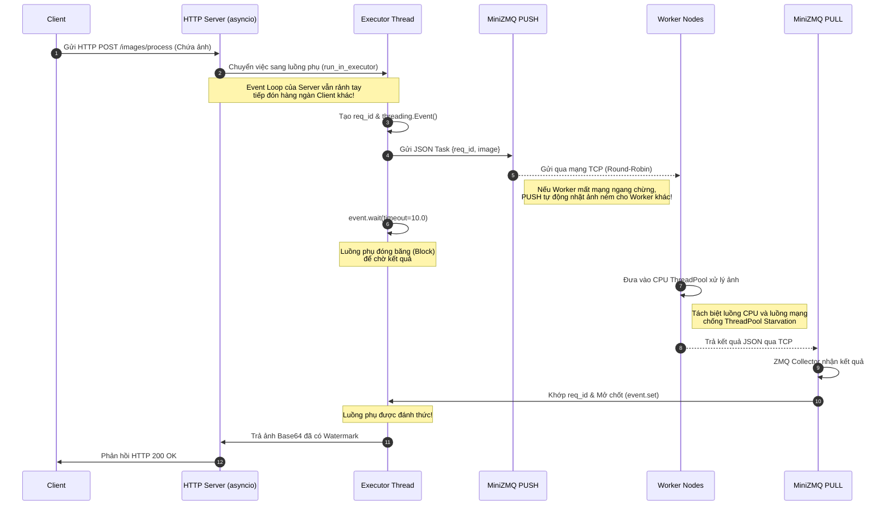
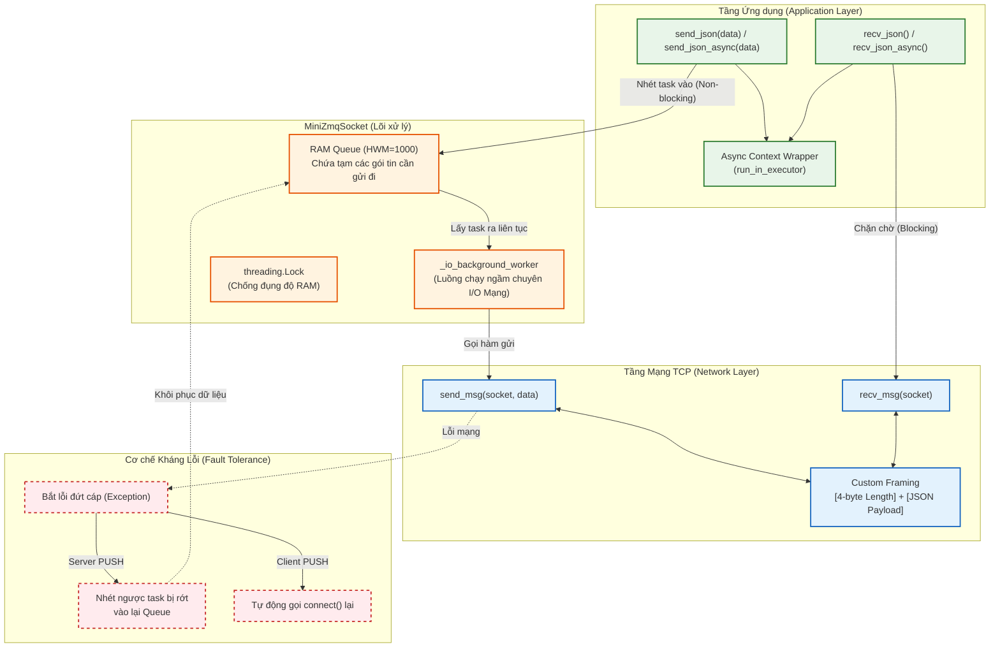

# Sơ đồ Kiến trúc & Luồng xử lý AsynApRous

Bạn có thể copy mã nguồn `Mermaid` bên dưới và dán trực tiếp vào **Draw.io** bằng cách chọn: **Arrange > Insert > Advanced > Mermaid...**

## 1. Sơ đồ Kiến trúc Tổng thể (Architecture Diagram)
Mô tả các thành phần cấu tạo nên hệ thống và cách chúng liên kết với nhau qua mạng.

---

## 2. Sơ đồ Trình tự Xử lý (Sequence Diagram)
Mô tả chi tiết vòng đời của 1 Request từ lúc gửi đến lúc nhận, nhấn mạnh vào các cơ chế chống kẹt luồng và kháng lỗi.

---

## 3. Sơ đồ Cấu trúc Nội bộ MiniZMQ (MiniZMQ Internals)
Mô tả cách `minizmq.py` hoạt động ở dưới nền (Under the hood) để đảm bảo không chặn luồng (Non-blocking) và không mất dữ liệu.

